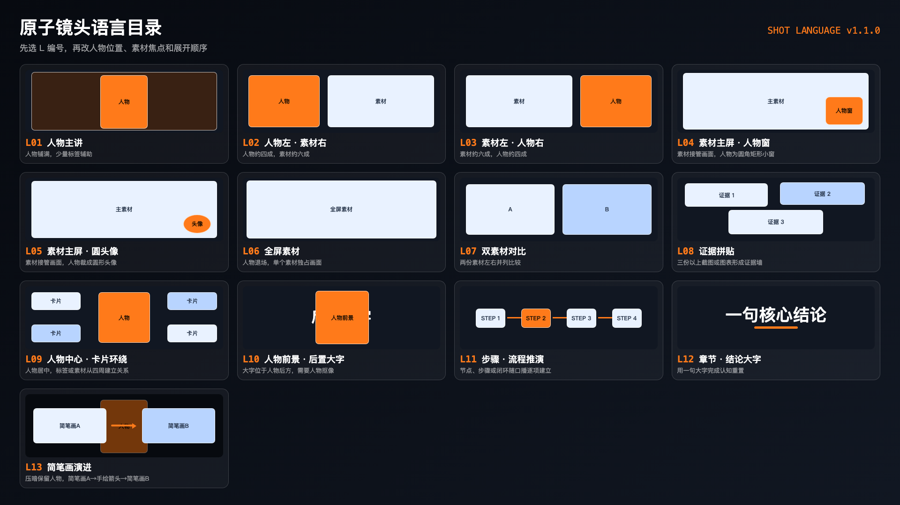

# 原子镜头语言使用手册

这套语言的目的不是让你学习专业剪辑术语，而是让你和 AI 指向同一个画面。
你不需要背 `L01–L13`：可以看静态目录选图，也可以直接说“录屏铺满＋右下圆角人物画中画”。
AI 会把自然描述归一到布局编号；编号只是以后修改初稿时的快捷方式。



## 两种使用模式

- **AI 创建初稿**：AI 内部补齐口播锚点、表达任务、主角、布局、焦点和展开顺序。
- **你修改初稿**：只需说“镜头编号＋想改什么”，未提到的字段全部继承，不必重新描述整镜。

## 最短表述模板

> 从【哪句口播】到【哪句口播】，用【布局图／自然描述／L 编号】。整块主要内容是【人物／录屏／截图／图解／大字】，其中重点看【具体区域】。展开顺序是【1–3 步】。需要【素材清单】。只有出现人物小窗、圆头像或需要覆盖默认位置时，才补充人物形态和位置。

示例：

> 从“这里就是 IndexShare”到“它会跨章节找重点”，用“录屏铺满＋右下圆角人物画中画”，也就是 `L04`。录屏是整块主要内容，其中重点看 IndexShare 这一行。录屏先接管画面，再框出 IndexShare，最后弹出“跨章节找重点”。需要设置页录屏。

## 13 个布局编号

| 编号 | 名称 | 一眼辨认 | 常用场景 |
|---|---|---|---|
| `L01` | 人物主讲 | 人物铺满，少量标签 | 提问、态度、总结、换气 |
| `L02` | 人物左・素材右 | 左边人物，右边素材 | 边讲边演示 |
| `L03` | 素材左・人物右 | 左边素材，右边人物 | 证据加讲解 |
| `L04` | 素材主屏・人物窗 | 素材铺大，人物是圆角矩形 | 长一点的录屏或文档讲解 |
| `L05` | 素材主屏・圆头像 | 素材铺大，人物是圆形裁切 | 录屏长期占主流，人物只陪伴 |
| `L06` | 全屏素材 | 人物完全退场 | B-roll、完整演示、强证据 |
| `L07` | 双素材对比 | 两份内容同尺寸并列 | 前后、A/B、粗略/详细 |
| `L08` | 证据拼贴 | 三份以上素材形成证据墙 | 表达数量、研究量、案例规模 |
| `L09` | 人物中心・卡片环绕 | 人物居中，卡片围绕 | 介绍经历、问题、能力构成 |
| `L10` | 人物前景・后置大字 | 文字被人物头肩挡住 | 金句、章节、核心定义 |
| `L11` | 步骤・流程推演 | 节点和箭头逐项建立 | 步骤、循环、时间线、目录树 |
| `L12` | 章节・结论大字 | 一句大字独占画面 | 认知重置、章节幕、结论 |
| `L13` | 简笔画演进 | 压暗保留人物，简笔画A→手绘箭头→简笔画B | 从一个状态到另一个状态的演变 |

静态目录见本页顶部；开发预览时也可以在 Remotion Studio 选择 `ShotLanguageCatalog`。

## 容易混淆的词

- **人物画中画（圆角矩形）**：保留肩膀、手势和更多表情，简称“人物窗”。对应 `L04`。
- **圆头像**：圆形裁切，只保留头脸，存在感更弱。对应 `L05`。
- **人物让位**：人物仍是原画，但缩小或移到一侧。对应 `L02/L03`。
- **人物退场**：这段完全不显示人物。对应 `L06/L07/L08/L12`。
- **后置大字**：文字在人物后方，必须先有人物抠像。对应 `L10`。
- **绕脸排版**：标签在人物四周，但不进入眼睛和嘴部保护区。通常对应 `L09`。
- **截图聚焦**：整张截图保留，只让一个区域清晰、变亮、加框或放大。
- **证据纹理**：原文可以看出“确有资料”，但不要求观众读完；真正要读的内容必须另行放大。

## AI 创建镜头时内部确认的六项

这些字段主要由 AI 填，你审阅时不必逐项回答：

1. **口播锚点**：从哪句话开始，到哪句话结束？
2. **表达任务**：表达观点、演示操作、展示证据、比较差异、解释流程、强调结论、换气还是分章节？
3. **画面主角**：占据主要面积、观众第一眼看到的整块内容是什么？一镜只能有一个主角。
4. **布局**：匹配 `L01–L12`，或先用自然语言描述再由 AI 匹配。
5. **视觉焦点**：在主角内部，具体要看哪个词、按钮、人物表情或流程节点？
6. **展开顺序**：这一镜有哪 1–3 个变化节点？

以素材为主时再补素材文件；需要后置大字时再补人物抠像；其他参数都可以继承默认值。

## 可组合原子

### 人物原子

- 原片人物（保留原视频背景）
- 圆角矩形人物窗
- 圆头像
- 抠像人物
- 压暗背景人物
- 人物退场

位置统一使用九宫格：左上、上中、右上、左中、居中、右中、左下、下中、右下。

### 素材原子

- 截图、录屏、图片、补充画面（B-roll）
- 裁到重点、放大重点
- 其余压暗、其余失焦
- 局部清晰、框选、荧光笔、引线说明、手写圈（`focus.mode: "circle"`，图片/视频都能圈）
- 保留来源、去掉无关界面

### 文字原子

- 章标：持续存在的小章节名
- 主结论：一镜唯一的大句子
- 关键词：主结论中的强调词
- 标签：给人物、节点和素材命名
- 注释：由引线连接的解释
- 来源：网站、作者、数据出处
- 字幕：口播兜底，不参与主视觉竞争

### 动作原子

- 入场：淡入、侧滑、上浮、弹入、展开、描边、画线
- 展示：轻推近、逐项点亮、局部放大、当前亮起、其他变暗
- 退场：淡退、收拢、缩进角落、让位、被下一画面接管

不用写具体动画曲线。按需要写 1–3 步即可，没有必要不必硬凑“最后”，系统会换算成帧。

## 用户修改初稿的最短语法

你拿到 AI 的分镜建议后，可以直接这样改：

- `保留 S03，但 L05 改成 L04；我要人物窗，不要圆头像。`
- `S06 删特效，恢复原片人物画面；连续两镜都在展示截图，太密了。`
- `S07 并入上一镜，让上一镜延长到这里。`
- `S08 的人物窗从右下移到右上，别挡住导出按钮。`
- `S10 仍用 L11，但先只出现 1、2，讲到“复盘”时再补 3、4。`
- `00:42–00:47 不要图解，改回 L01 人物主讲，让观众休息。`
- `S13 素材不够，先标为待补，不要拿无关 B-roll 顶替。`

## 组合规则

1. 一镜一个主角、一个主结论、一个主要视觉变化；展开节点可有 1–3 步。
2. 布局编号决定骨架；“压暗、发光、颗粒”等只属于局部修饰。
3. 普通镜头最多一个主对象和两个辅助对象；三份以上素材要明确使用 `L08`。
4. 口播顺序就是动画顺序，不能一开始就把最终画面全部摆满。
5. 完整截图负责证明；需要阅读的内容必须裁切、放大或局部清晰。
6. 人脸默认不挡眼睛、嘴和手势；字幕安全区永远保留。
7. 每镜必须有稳定态：动画结束后要留够阅读时间。
8. 冲突时优先级：人脸／证据重点 > 主结论 > 标签 > 装饰。
9. 抠像质量不足时，`L10` 自动降级为人物左右排字，不强行穿插。
10. 连续密集信息后，优先回到 `L01` 或切一镜 `L06` B-roll 换气。

未写镜头卡的时间段默认显示原始母版人物和字幕，不会黑屏；“删特效”也会回到这个默认状态。

## 给 AI／开发者的 JSON 附录

用户不需要阅读或手写以下内容。AI 会把确认后的镜头卡写成 `type: "shot"` 场景并自动校验：

```json
{
  "type": "shot",
  "id": "S04",
  "start": 12.4,
  "end": 17.8,
  "anchor": { "start": "这里就是 IndexShare", "end": "它会跨章节找重点" },
  "intent": "evidence",
  "primary": "screen",
  "layout": "L04",
  "focus": "IndexShare 这一行",
  "presenter": { "form": "window", "placement": "bottom-right" },
  "media": [{ "id": "screen", "src": "index-share.mp4", "kind": "video" }],
  "beats": [
    { "atSec": 0.1, "action": "show", "target": "screen" },
    { "atSec": 1.2, "action": "focus", "target": "screen.focus" }
  ]
}
```

规划阶段运行：

```bash
npm run validate:shots
```

正式渲染前运行严格模式：

```bash
npm run validate:shots:strict
```

校验器会检查布局、时间、素材、圆头像／人物窗冲突、抠像依赖和展开时刻；`npm run render` 已自动包含严格校验。
